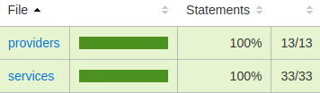
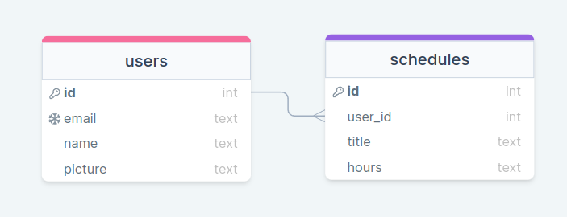

<!-- PROJECT LOGO -->
<br />
<div align="center">
  <a href="https://github.com/kirodoras/see-me-back">
    
  </a>

<!-- Link to src -->
  <h3 align="center">See me</h3>
  <p>
    Back end Development Project
    <br />
    <a href="https://github.com/kirodoras/see-me-back/tree/main/src"><strong>Browse TypeScript code</strong></a>
    </p>
    <a href="https://github.com/kirodoras/see-me-front"><strong>Front end repository</strong></a>
</div>

<!-- Built With -->
<div align="center">
  <h3>Built With</h3>
  
   
  
  
  
    
  
  
</div>

<!-- Table of Contents -->
# Table of Contents

- [Description](#description)
- [Getting Started](#getting-started)
- [Running tests](#running-tests)
- [Coverage](#coverage)
- [Draw SQL](#draw-sql)
- [Routes](#routes)
  - [Token](#token)
  - [Users](#users)
  - [Schedules](#schedules)
- [Contact](#contact)

<!-- Description -->
# Description

An API to generate `Agora.io` video call token and register users and schedules.

<!-- Getting Started -->

# Getting Started

This Api can be used in two different ways: by cloning the project or by using your preferred client, such as [Insomnia](https://insomnia.rest/) or [Postman](https://www.getpostman.com/).

First of all configure an `.env` file following the `.env.example`

To clone the project, run the following command:

```git
git clone https://github.com/kirodoras/see-me-back
```

Then, navigate to the project folder and run the following command:

to install dependencies:
```git
npm i -y
```
to migrate the database:
```git
npm run migrate
```
Finally, start the server:

```git
npm run dev
```

You can now access the API's endpoints by navigating to `http://localhost:5008/` or to the deployed URL `https://app-see-me.herokuapp.com/`.
<!-- Tests -->
# Running tests
After following the [Getting Started](#getting-started) steps, follow the commands:

First of all configure an `.env.test` file

to migrate the test database:
```git
npm run test:migrate
```
Finally, run the integration tests:
```git
npm run test
```
or run the unit tests:
```git
npm run test:unit
```
<!-- Coverage -->
# Coverage
<div align="center">
  
</div>

<!-- API Reference -->
# Draw SQL

<div align="center">
  
</div>

<!-- Routes -->
# Routes
## [Token](#token) _`/token`_

## [Users](#users) _`/users`_

- [Login](#login) `/login`
- [Find](#find) `/find`

## [Schedules](#schedules) _`/schedules`_

- [Create a schedule](#create-a-schedule) `/create`
- [Find schedules by user id](#find-schedules-by-user-id) `/findByUserId`
- [Delete schedule by id](#delete-schedule-by-id) `/delete/:id`

<!-- Routes infos -->
# Token
```yml
GET /token?channelName={NAME}
    - headers: {}
    - body: {}
RESPONSE IN SUCCESS
    - status: 200
    - data: {
        token: AGORA.IO CHANNEL TOKEN
    } 
```

# Users
## Login
```yml
POST users/login
    - headers: {}
    - body: {
        email: "hulk@email.com",
        name: "Bruce Banner",
        picture: "https://picture.url..."	
    }
RESPONSE IN SUCCESS
    - status: 201
    - data: {
        email: "hulk@email.com",
        name: "Bruce Banner",
        picture: "https://picture.url...",
        token: JWT TOKEN
    } 
```
## Find
```yml
POST users/find
    - headers: {}
    - body: {
        email: "hulk@test.com",
    }
RESPONSE IN SUCCESS
    - status: 200
    - data: {
        email: "hulk@email.com",
        name: "Bruce Banner",
        picture: "https://picture.url...",
        token: JWT TOKEN
    }    
```

# Schedules

## Create a schedule
```yml
POST /schedules/create
    - headers: {
      "Authorization": Bearer [JWT-TOKEN]
    }
    - body: {
        title: "My title",
        hours: "12:12"
    }
RESPONSE IN SUCCESS
    - status: 201
    - data: {
        id: 6,
        title: "My title",
        hours: "12:12",
        user_id: 2
    }
```

## Find schedules by user id
```yml
GET /schedules/findByUserId
    - headers: {
      "Authorization": Bearer [JWT-TOKEN]
    }
    - body: {}
RESPONSE IN SUCCESS
    - status: 200
    - data: Object[] of schedules
```

## Delete schedule by id
```yml
GET /schedules/delete/:id
    - headers: {
      "Authorization": Bearer [JWT-TOKEN]
    }
    - body: {}
RESPONSE IN SUCCESS
    - status: 200
```
